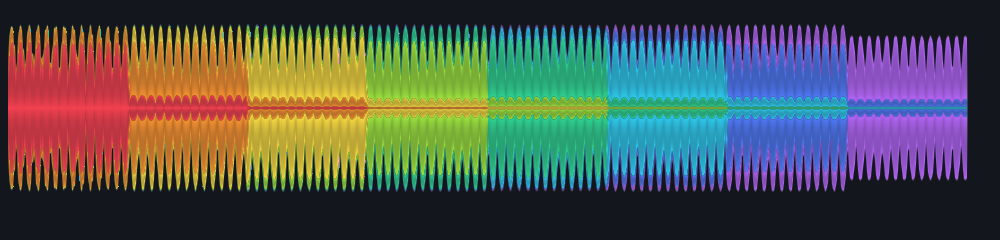

# Detailed frequency waveforms

Decoded deck media, native project media and factory samples now retain stereo peak envelopes and eight measured frequency bands. The deck, beatgrid editor and sampler editor share the same continuous mesh renderer. The previous 2,048 whole-track magnitude buckets remain available for older analysis records; they no longer limit newly decoded waveform detail.

The finest level targets 2.5 ms source intervals, up to 65,536 bins. A peak-preserving pyramid selects detail for each physical display pixel, including HiDPI displays. One source waveform retains less than 2.1 MB of analysis storage. PCM is analyzed on preparation workers; snapshots share immutable analysis through an Arc and retain no additional PCM. Queue, sampler and Undo budgets account for the added storage.

Colors represent overlapping bands: red 20–60 Hz, orange 60–150 Hz, yellow 150–400 Hz, lime 400 Hz–1 kHz, green 1–2.5 kHz, cyan 2.5–6 kHz, blue 6–12 kHz and violet 12–24 kHz. The upper range follows source Nyquist. Stereo energy is measured separately before summing, so opposite channel phases cannot erase a waveform. Biquad preparation follows the [W3C Audio EQ Cookbook](https://www.w3.org/TR/audio-eq-cookbook/). This is frequency-band energy, not a calibrated spectrum analyzer.

Software checks:

- 23 waveform-related tests pass, including 44.1/48/96 kHz frequency discrimination, opposite stereo phases, narrow transients, cancellation, bounded storage, normal/HiDPI geometry, markers and project views.
- The full Rust suite passes: 1,704 tests, zero failures, 42 explicitly ignored and one unchanged exhaustive scene-index test filtered. This run preceded the final sampler display/help reuse; focused qualification covers that final UI change separately.
- Real periodic snapshot publication remains allocation/free-free on the audio callback. Held snapshots keep analysis alive while allowing source PCM retirement. Snapshot materialization allocation counts remain independent of waveform length.

The image comes from the actual egui mesh over original generated tones. Capture services are closed at Michael's request. No new physical controller gestures, PA listening checks or converter/display timing measurements are part of this software qualification. Installed-build provenance and the visible app check are recorded in the accompanying receipt.
